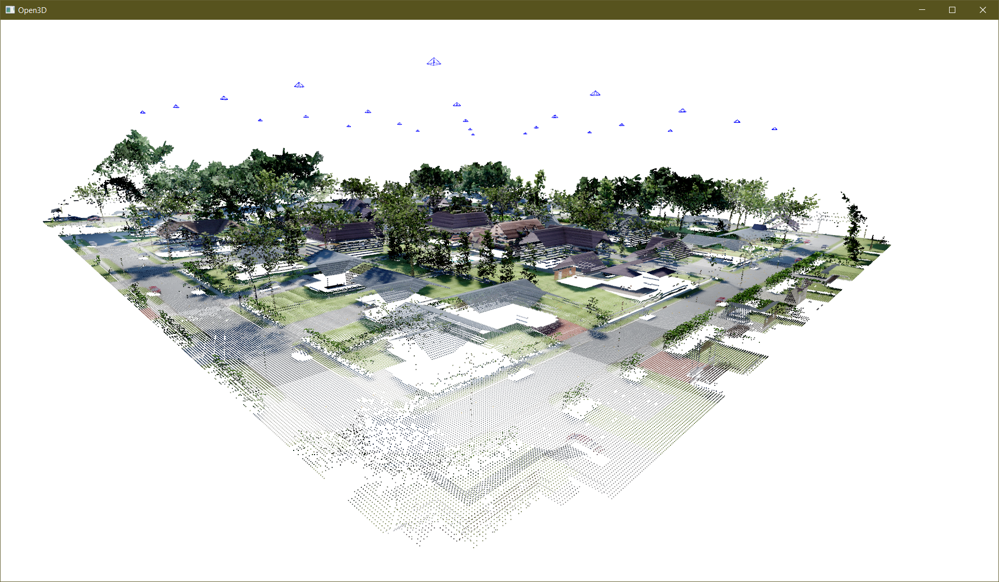

# 3D Point Cloud Reconstruction with AirSim

If you use our code or workflow, please reference our ICCV WAMMI 2021 article. Latex citation: 

@article{alvey_anderson_buck_deardorff_keller, title={Simulated Photorealistic Deep Learning Framework and Workflows to Accelerate Computer Vision and Unmanned Aerial Vehicle Research}, journal={Workshop on Analysis of Aerial Motion Imagery (WAAMI) in conjunction with International Conference on Computer Vision (ICCV 2021)}, author={Alvey, Brendan and Anderson, Derek and Buck, Andrew and Deardorff, Matthew and Keller, James}}

[AirSim](https://microsoft.github.io/AirSim/) can be used to collect and reconstruct 3D point clouds using [Unreal Engine](https://www.unrealengine.com/). This page describes how to set up your environment to collect data, either manually or from a list of pre-scripted waypoints, and reconstruct a 3D point cloud from a sequence of color and depth images, along with the corresponding camera poses. The resulting data is visualized using [Open3D](http://www.open3d.org/) and can be used for a variety of research applications.



## Installing AirSim and Python

AirSim is a plugin for Unreal Engine that provides a Python API to control a virtual drone camera in a 3D scene. For this example, we will be using the Computer Vision mode of AirSim, which ignores the simulation of a physical drone and instead provides a way to control the camera directly.

### AirSim Environment Setup

First, we need a game world environment that supports AirSim. There are two options:

- Download a precompiled binary package of an environment. The latest release can be found here:

  https://github.com/Microsoft/AirSim/releases

- Build it from source and use a custom environment. Follow the instructions here:

  https://microsoft.github.io/AirSim/build_windows/

  (Note that we have only tested Windows development)

Here, we focus on the first option using a precompiled binary, but these instructions should also work in custom environments. 

For this example, we'll use the AirSim Neighborhood environment, which can be downloaded here:

https://github.com/microsoft/AirSim/releases/download/v1.6.0-windows/AirSimNH.zip

#### Settings File

You'll also need the `settings.json` file from the git repo to be placed in your AirSim directory. On a typical installation it's set to `C:\Users\<username>\Documents\AirSim`. This tells the plugin important information about what types of cameras to use, image resolution, recording options, and lots of other settings. The provided `settings.json` file is a good starting point, and can be edited once you become familiar with the parameters available.

### Python Setup

An easy way to keep Python environments organized and independent is to use the [Conda](https://docs.conda.io/en/latest/index.html) package manager, either as part of the full-featured [Anaconda](https://www.anaconda.com/) distribution, or as the minimal [Miniconda](https://docs.conda.io/en/latest/miniconda.html) installer. It's recommended to setup the environment from an administrator terminal to , although this may not be required.

Once Conda is installed on your system, you can run

```
conda create --name sim python=3.8
```

to create a new Python 3.8 environment. (Note that we are using Python 3.8 due to some dependency issues with Open3D.)

Activate the new environment with

```
conda activate sim
```

Install the dependencies with

```
pip install open3d
pip install msgpack-rpc-python
pip install airsim
pip install pandas pillow tqdm
```

(Note: Depending on your system configuration, you may need to run these commands as administrator. You will likely see errors describing dependency conflicts, however installing the packages in the specified order should allow our example to work. For reference, a `requirements.txt` file included in the repo lists the package versions we used, but due to unresolvable dependencies it cannot be used directly.)

Experienced Python users may find the following guides helpful to setup AirSim and Open3D environments:

- AirSim: https://microsoft.github.io/AirSim/apis/
- Open3D: http://www.open3d.org/docs/release/getting_started.html

## Collecting Data

We describe two methods for collecting data in AirSim: manual and scripted. For the manual approach, we will launch the AirSim runtime and control the drone camera with the keyboard. The scripted approach will use a Python script to move the drone to specified waypoints. Both approaches will save data in the [AirSim recording format](https://microsoft.github.io/AirSim/settings/#recording).

Start by running the Unreal environment with the AirSim plugin. For this example using the neighborhood map, unzip the binary package from above and run `AirSimNH.exe`. For other environments, launch the executable or put the Unreal Editor into "Play" mode. You may need to click inside the window to make it active. Make sure your `settings.json` file is stored in the correct location and is loaded properly.

### Manual Recording

In Computer Vision mode (set by the settings file), you can steer the drone camera with the following keyboard controls:

- `Arrow keys` -> Move forward, backward, left, right
- `Page Up`/`Page Down` -> Move up, down
- `A`,`D` -> Yaw
- `W`,`S` -> Pitch

Pressing `Backspace` will reset the drone to the original position.

Press `R`  to start or stop recording. (Note that our settings file is configured to only record data frames when the drone has moved.) Once recording has started, data will be saved in a timestamped folder in your AirSim directory, `C:\Users\<username>\Documents\AirSim`. The recording directory contains a metadata file `airsim_rec.txt` that includes camera pose information for each frame. Inside the `images` directory, you will find the color and segmentation images stored as 'png' files, and the depth image data stored as a floating point array in the 'pfm' format. We will demonstrate how to use this data in the reconstruction section of this example.

### Scripted Recording

In many cases, it may be preferable to automate the data collection process. An example script demonstrating how to generate waypoints in a "lawnmower" pattern is provided in `airsim_collect.py`. It can be run with

```
python airsim_collect.py
```

This script connects to the AirSim drone using the Python API. It tells the drone to start recording and then moves between waypoints. Since the settings file is configured to record only after moving, it collects a new frame at each waypoint. The data is stored in a timestamped folder in your AirSim directory, `C:\Users\<username>\Documents\AirSim`.

The script defines a bounding region around the initial starting location, an altitude, and a step size. The units for working with AirSim are in meters. In the example, the bounds are set to +/- 100 m in the x and y directions, with an altitude of 50 m and a step size of 50 m. After each waypoint is generated, the AirSim API function `simSetVehiclePose` is called to move the drone and record a new frame. A short delay is included to ensure that the data from each waypoint has time to be written to disk. Including a delay can also help with loading assets into the Unreal environment after moving the camera.

This scripting approach can also be used for other collection patterns. Optionally, waypoints could be loaded from an external source, such as a CSV file, and then used to position the drone camera for each frame.

For more interactive control, it may be useful to use the AirSim Image APIs to access the image data directly in the Python code. We recommend the `simGetImages` function call, which can provide multiple image types simultaneously. More information can be found at https://microsoft.github.io/AirSim/image_apis/.

## 3D Reconstruction

The reconstruction script `airsim_reconstruct.py` can be used to build a 3D point cloud from a recorded AirSim sequence. Options are provided to load a specific run by its folder name (timestamp) or to simply reconstruct the last run. Additionally, we can specify a step size to skip frames, a maximum depth distance, and choose whether to save a point cloud for each frame or just the entire combined scene. The option flag `--seg` will use the segmentation colormap instead of the true image colors, and the flag `--vis` will automatically display the result.

Here is the full parameter list for the reconstruction script:

```
>python airsim_reconstruct.py --help
usage: airsim_reconstruct.py [-h] (-r RUN | -l) [-s STEP] [-t DEPTH_TRUNC] [-w] [--seg] [--vis]

optional arguments:
  -h, --help            show this help message and exit
  -r RUN, --run RUN     folder name of the run
  -l, --last            use last run
  -s STEP, --step STEP  frame step
  -t DEPTH_TRUNC, --depth_trunc DEPTH_TRUNC
                        max distance of depth projection
  -w, --write_frames    save a point cloud for each frame
  --seg                 use segmentation colors
  --vis                 show visualization
```

After collecting a data sequence with the `airsim_collect.py` script, we run

```
python airsim_reconstruct.py -l -w --vis
```

This will loop over all the frames in the last recording and show the combined point cloud in an Open3D window. You can navigate the 3D view using the mouse and adjust the point size with the `+`/`-` keys. The position of the camera for each frame is also displayed in this view. The combined point cloud is saved in the recording directory as `points_rgb.pcd` using the commonly used [PCD file format](https://en.wikipedia.org/wiki/Point_Cloud_Library#PCD_File_Format). Since the `-w` parameter is included, the points for each frame are saved in the `points` folder, along with the camera parameters in a 'json' format that is compatible with Open3D. Running the command again with the `--seg` flag will also create point clouds using the segmentation colors.

The recorded images from simulation and reconstructed point clouds can be used for various applications. One way to quickly verify the data is to use a viewer such as [CloudCompare](https://www.danielgm.net/cc/) to visualize the combined point cloud as well as the individual frames. We hope this method can accelerate research workflows!

