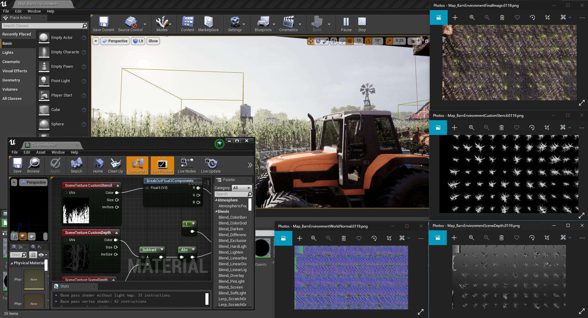
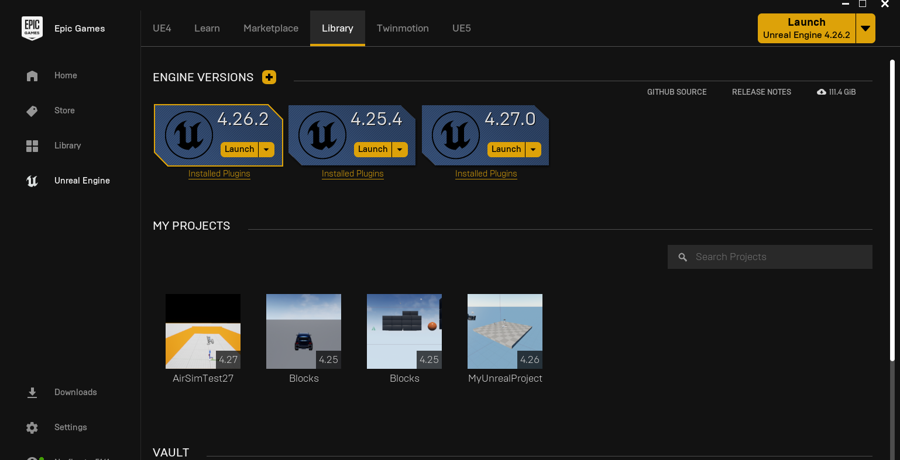
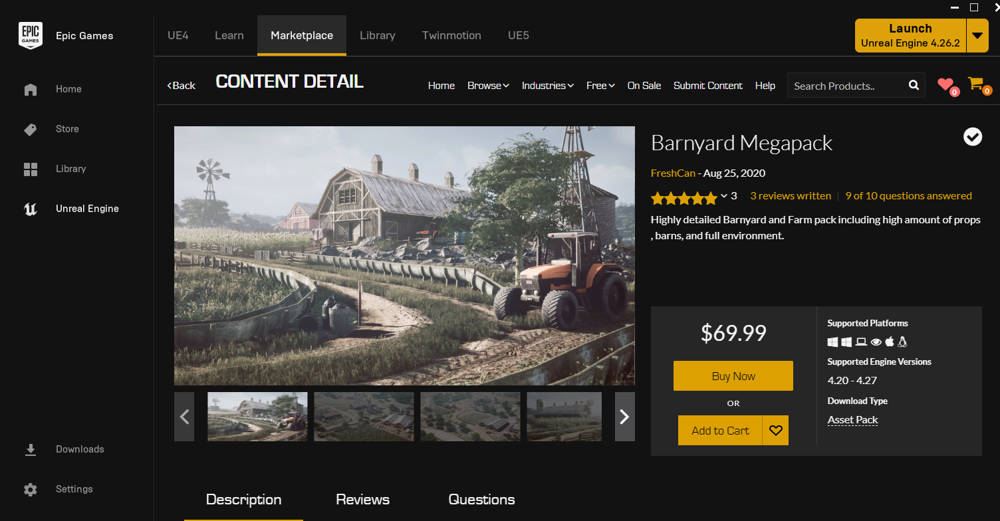
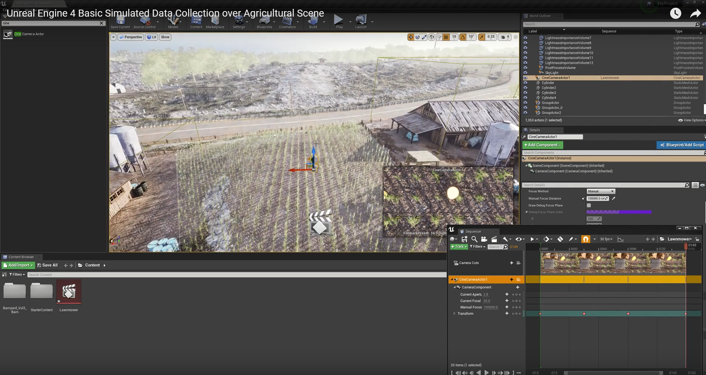
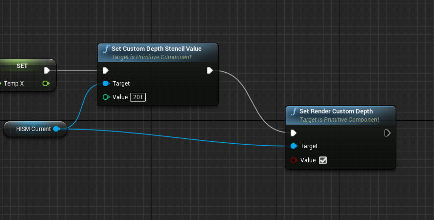
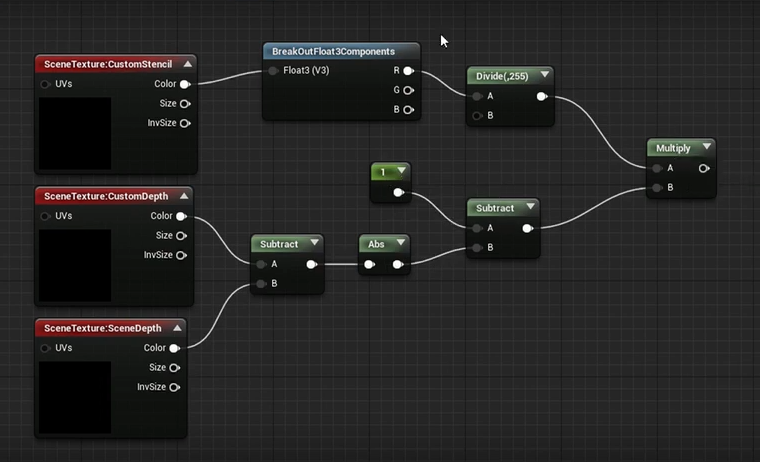

# Unreal Engine 4 Basic Simulated Data Collection Tutorial

## Introduction

This document describes how to setup and collect data using only the native Unreal Engine 4 tools and the [Movie Render Plugin](https://docs.unrealengine.com/4.26/en-US/AnimatingObjects/Sequencer/Workflow/RenderAndExport/HighQualityMediaExport/). This could be used to easily standup data collections to facilitate machine learning, computer vision, robotics, or any other project that can make use of the simulated imagery. 

Please see the accompanying "Unreal Engine 4 Basic Simulated Data Collection over Agricultural Scene" tutorial video at: [Mizzou Mindful YouTube Channel](https://bit.ly/MizzouINDFUL)

If you use our code or workflow, please reference our work. ICCV WAMMI 2021 latex citation: 

@article{alvey_anderson_buck_deardorff_keller, title={Simulated Photorealistic Deep Learning Framework and Workflows to Accelerate Computer Vision and Unmanned Aerial Vehicle Research}, journal={Workshop on Analysis of Aerial Motion Imagery (WAAMI) in conjunction with International Conference on Computer Vision (ICCV 2021)}, author={Alvey, Brendan and Anderson, Derek and Buck, Andrew and Deardorff, Matthew and Keller, James}}

## Unreal Engine Setup

1. Download and install the [Epic Games Launcher](https://www.epicgames.com/store/en-US/download)
2. Open the Epic Games Launcher and click on the Unreal Engine tab on the left. Click on the Library tab then click the "+" button next to ENGINE VERSIONS to select and install Unreal Engine v4.26.2
3. Launch the engine and create a blank project. Select the Architecture, Engineering, and Construction template category, select blank, and specify a location for the project then click Create Project. 
4. By default the Movie Render Queue Plugin should be enabled. To double check, Click Edit in the top menu of the Unreal Engine Editor and select plugins. Search for the Movie Render Queue Plugin and ensure that it is enabled. 

## Download and Load Content

1. In the Epic Games Launcher, navigate to the Marketplace tab in the Unreal Engine section. Select and download any content packages you want to use. In the tutorial video, we used the [Barnyard Megapack](https://www.unrealengine.com/marketplace/en-US/product/barnyard-mega-pack) Add your downloaded content to the project you created.
2. Open your added content in the editor. With most content packs you can open a map by clicking on File->Open Level->Content->Content Package Name->Maps->Map Name

## Simulated Data Collection

1. Click Window->Load Layout->Default Editor Layout 
2. In the Place Actors tab, search for "Cine Camera Actor" and place one into your scene. There are a number of different parameters that can be changed for the camera. 
    1. Transform:  Manual entry of Position and Orientation. (Can also be edited by moving the object around in the scene)
    2. Current Camera Settings: Controls the simulated camera type. Defines focal and lens settings. 
    3. Camera Options: Uncheck "Constrain Aspect Ratio" to allow variable camera resolutions. 
3. Move the camera to the desired pose for the first keyframe. 
4. Click the Cinematics button and select "Add Level Sequence"
5. Click the green +Track button, under "Add Actor to Sequence", add the Cine Camera Actor you placed in the scene
6. Press S to create a keyframe.
7. Move the red bar to the frame number you want the next keyframe to be at in the sequence editor.
8. Press S to create the next keyframe. 
9. Click the Film looking button to set output options (resolution, directory, render pass).
10. Click capture to begin saving data to the Saved folder of your project directory. 

## Object Labels and Scene Depth 

1. In the editor, click Edit->Project Settings. Search for "Custom Depth-Stencil Pass" and select "Enabled with Stencil"
2. To assign a stencil value to an object, click on and object in the World Editor panel. Under Rendering enable the "Render CustomDepth Pass" and set the "CustomDepth Stencil Value" to an integer value. For objects that are generated using a blueprint, the blueprint must be modified. At the end of execution, add the "Set Custom Depth Stencil Value" and set the stencil value to whatever you want and add the "Set Render Custom Depth" block as shown in the image below. 

3. Set the "Image Output Format" option in the sequencer (see previous section, step 9.) to "Custom Render Passes"
4. Under "Composition Graph Options"->"Include Render Passes" add "Custom Stencil", "Scene Depth", and "Final Image" to output object labels, depth, and RGB images for the sequence. See the video for modifying the stencil buffer to remove the text and/or take into account occlusion of other objects. 
5. To remove text value tiling and/or to label only valid points, taking into account occlusion first enable viewing Engine Content in the View Options at the bottom left of the content browser. Then browse Engine Content -> BufferVisualization -> CustomStencil. Substitute the custom material pipeline shown in the image below.   

Valid point CustomStencil material.

